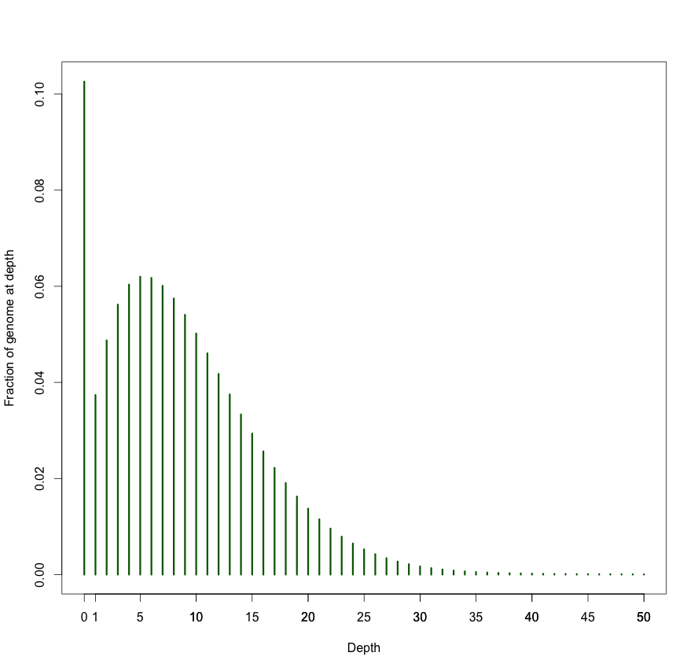
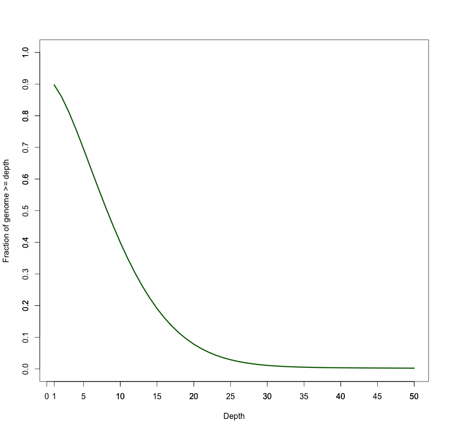
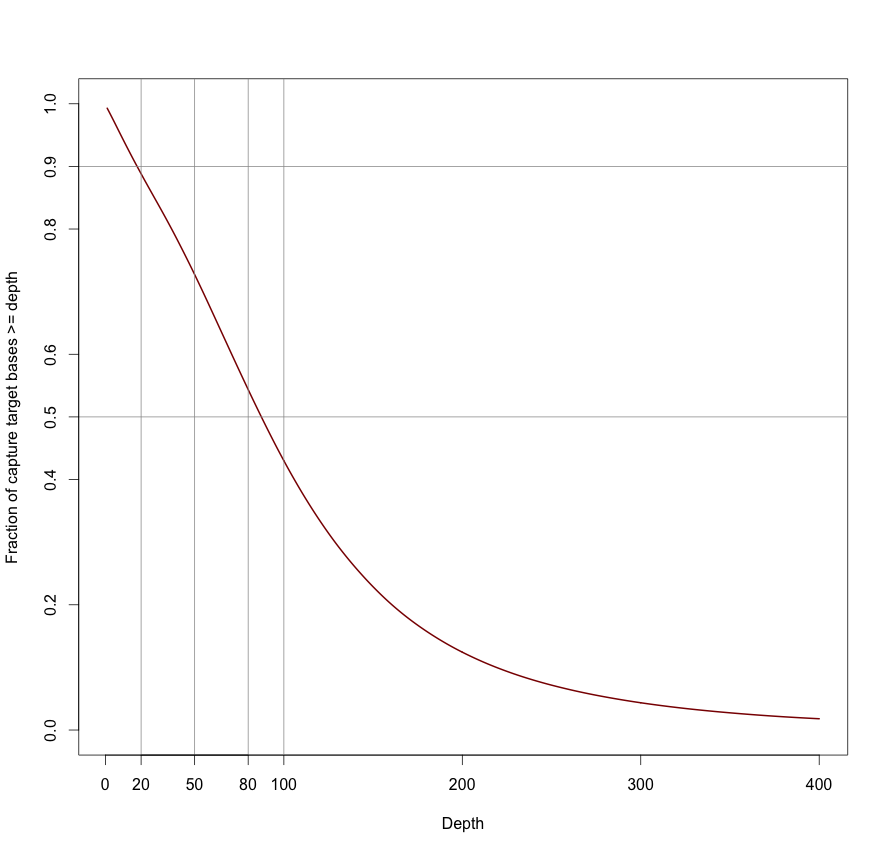
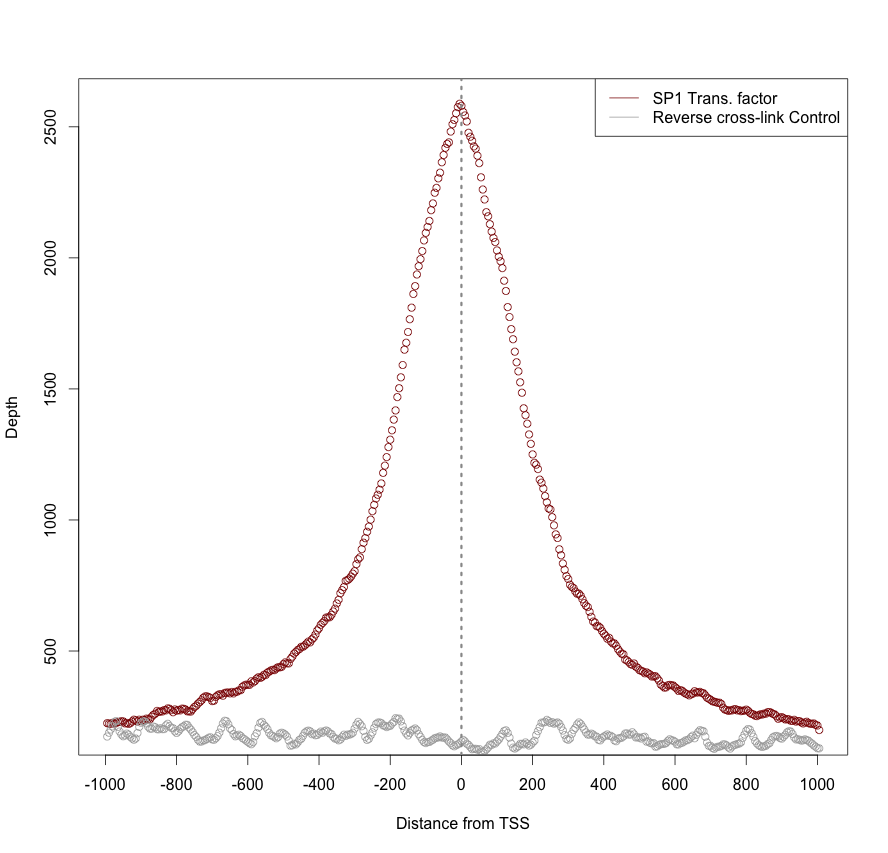
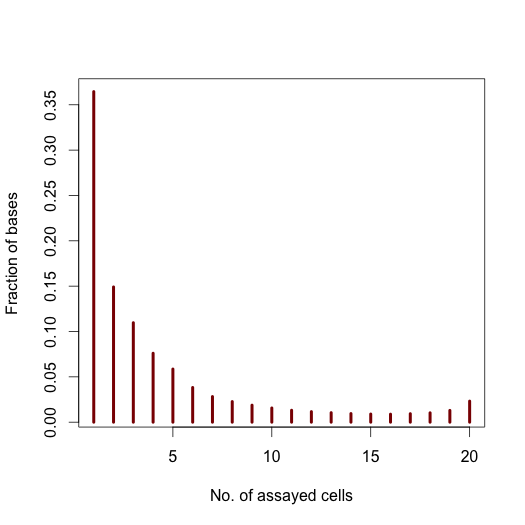
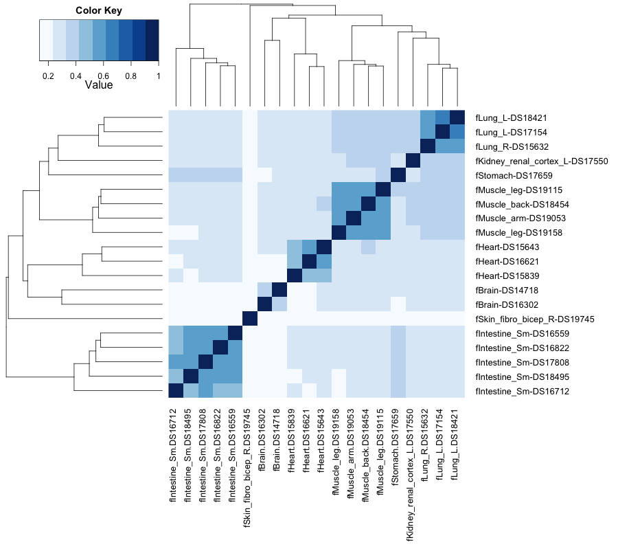

% bedtools Tutorial
% Aaron Quinlan
% November 22, 2013

Abstract
========

Introduction
============

Sophistication through chaining multiple bedtools
=================================================
Analytical power in `bedtools` comes from the ability to "chain" together multiple tools in order to construct rather sophisicated analyses with very little programming - you just need **genome arithmetic**!  Have a look at the examples [here](http://bedtools.readthedocs.org/en/latest/content/advanced-usage.html).
- put everything in a Github GIST

We therefore encourage you to read the bedtools [documentation](http://bedtools.readthedocs.org/en/latest/).

The bedtools help
-----------------
To bring up the help, just type

    bedtools

As you can see, there are multiple "subcommands" and for bedtools to
work you must tell it which subcommand you want to use. Examples:

    bedtools intersect
    bedtools merge
    bedtools subtract

Strategic Planning
==================
- setup
- basic usage
- conventions:
    black font: command line
    blue font: R console
- dependencies
    - bedtools
    - R
    - R packages?
    - samtools?
    - mysql
- sorting 
    -show chromsweep comparison plot
- genome files

BP1: Intersecting genome feature files 
=====================================================

The `intersect` command is the workhorse of the `bedtools` suite. It compares two BED/VCF/GFF files (or a BAM file and one of the aforementioned files) and identifies all the regions in the gemome where the features in the two files overlap (that is, share at least one base pair in common).

By default, `intersect` reports the intervals that represent overlaps between your two files.  To demonstrate, let's identify all of the CpG islands that overlap exons.

~~~~ {#mycode .bash}
    bedtools intersect -a cpg.bed -b exons.bed | head -5
    chr1    29320   29370   CpG:_116
    chr1    135124  135563  CpG:_30
    chr1    327790  328229  CpG:_29
    chr1    327790  328229  CpG:_29
    chr1    327790  328229  CpG:_29
~~~~

AP1a: Reporting the original feature in each file.
--------------------------------------------------
The `-wa` (write A) and `-wb` (write B) options allow one to see the original records from the A and B files that overlapped.  As such, instead of not only showing you *where* the intersections occurred, it shows you *what* intersected.

~~~~ {#mycode .bash}
    bedtools intersect -a cpg.bed -b exons.bed -wa -wb \
    | head -5
    chr1    28735   29810   CpG:_116    chr1    29320   29370   NR  _024540_exon_10_0_chr1_29321_r    0   -
    chr1    135124  135563  CpG:_30 chr1    134772  139696  NR_ 039983_exon_0_0_chr1_134773_r    0   -
    chr1    327790  328229  CpG:_29 chr1    324438  328581  NR_ 028322_exon_2_0_chr1_324439_f    0   +
    chr1    327790  328229  CpG:_29 chr1    327035  328581  NR_ 028327_exon_3_0_chr1_327036_f    0   +
    chr1    327790  328229  CpG:_29 chr1    324438  328581  NR_ 028325_exon_2_0_chr1_324439_f    0   +
~~~~

AP1b: How many base pairs of overlap were there?
------------------------------------------------
The `-wo` (write overlap) option allows one to also report the *number* of base pairs of overlap between the features that overlap between each of the files.

~~~~ {#mycode .bash}
    bedtools intersect -a cpg.bed -b exons.bed -wo \
    | head -5
    chr1    28735   29810   CpG:_116    chr1    29320   29370   NR  _024540_exon_10_0_chr1_29321_r    0   -   50
    chr1    135124  135563  CpG:_30 chr1    134772  139696  NR_ 039983_exon_0_0_chr1_134773_r    0   -   439
    chr1    327790  328229  CpG:_29 chr1    324438  328581  NR_ 028322_exon_2_0_chr1_324439_f    0   +   439
    chr1    327790  328229  CpG:_29 chr1    327035  328581  NR_ 028327_exon_3_0_chr1_327036_f    0   +   439
    chr1    327790  328229  CpG:_29 chr1    324438  328581  NR_ 028325_exon_2_0_chr1_324439_f    0   +   439
~~~~

AP1c: Counting the number of overlapping features.
--------------------------------------------------
We can also count, for each feature in the "A" file, the number of overlapping features in the "B" file. This is handled with the `-c` option.

~~~~ {#mycode .bash}
    bedtools intersect -a cpg.bed -b exons.bed -c \
    | head -5
    chr1    28735   29810   CpG:_116    1
    chr1    135124  135563  CpG:_30 1
    chr1    327790  328229  CpG:_29 3
    chr1    437151  438164  CpG:_84 0
    chr1    449273  450544  CpG:_99 0
~~~~

AP1d: Find features that DO NOT overlap
--------------------------------------------
Often we want to identify those features in our A file that **do not** overlap features in the B file. The `-v` option is your friend in this case.

~~~~ {#mycode .bash}
    bedtools intersect -a cpg.bed -b exons.bed -v \
    | head -5
    chr1    437151  438164  CpG:_84
    chr1    449273  450544  CpG:_99
    chr1    533219  534114  CpG:_94
    chr1    544738  546649  CpG:_171
    chr1    801975  802338  CpG:_24
~~~~

AP1e: Require a minimal fraction of overlap.
--------------------------------------------
Recall that the default is to report overlaps between features in A and B so long as *at least one basepair* of overlap exists. However, the `-f` option allows you to specify what fraction of each feature in A should be overlapped by a feature in B before it is reported.

Let's be more strict and require 50% of overlap.

~~~~ {#mycode .bash}
    bedtools intersect \
             -a cpg.bed \
             -b exons.bed \
             -wo \
             -f 0.50 \
    | head -5
    chr1    135124  135563  CpG:_30 chr1    134772  139696  NR_ 039983_exon_0_0_chr1_134773_r    0   -   439
    chr1    327790  328229  CpG:_29 chr1    324438  328581  NR_ 028322_exon_2_0_chr1_324439_f    0   +   439
    chr1    327790  328229  CpG:_29 chr1    327035  328581  NR_ 028327_exon_3_0_chr1_327036_f    0   +   439
    chr1    327790  328229  CpG:_29 chr1    324438  328581  NR_ 028325_exon_2_0_chr1_324439_f    0   +   439
    chr1    788863  789211  CpG:_28 chr1    788770  794826  NR_ 047525_exon_4_0_chr1_788771_f    0   +   348
~~~~

AP1f: Require intersections with the same strand
------------------------------------------------

AP1g: Require intersections with opposite strands
-------------------------------------------------

AP1h: Working with sorted data.
-------------------------------------------------
Figure comparing bedtools to bedops.

\

BP2: Assessing coverage in DNA sequencing experiments 
=====================================================

http://bedtools.readthedocs.org/en/latest/content/tools/genomecov.html

~~~~ {#mycode .bash}
    # Download alignments for sample NA19146 in BAM format
    # from the 1000 Genomes Project.
    # Filesize: 
    # Estimate: 15-30 minute download
    KGFTP=ftp://ftp-trace.ncbi.nih.gov/1000genomes/ftp/data/NA19146/alignment
    
    curl -O $KGFTP/NA19146.mapped.ILLUMINA.bwa.YRI.low_coverage.20130415.bam

    # create a symbolic link for brevity
    ln -s NA19146.mapped.ILLUMINA.bwa.YRI.low_coverage.20130415.bam NA19146.bam
    
    # Calculate a histogram of coverage for each chromosome
    # as well as genome-wide.
    # Estimate: 30 minutes
    bedtools genomecov \
             -ibam NA19146.bam \
    > NA19146.coverage.hist.txt
~~~~

At this point, we can use R to plot the genome-wide distribution of coverage. 

~~~~ {#mycode .R}
    > cov = read.table('NA19146.coverage.hist.txt')
    > head(cov)
      V1 V2       V3        V4        V5
    1  1  0 29172804 249250621 0.1170420
    2  1  1  7196069 249250621 0.0288708
    3  1  2  9698769 249250621 0.0389117
    4  1  3 11608275 249250621 0.0465727
    5  1  4 12960686 249250621 0.0519986
    6  1  5 13769135 249250621 0.0552421

    # extract the genome-wide (i.e., no the per-chromosome)   histogram entries
    > gcov = cov[cov[,1] == 'genome',]
    > head(gcov)
              V1 V2        V3         V4        V5
    91947 genome  0 321856083 3137454505 0.1025850
    91948 genome  1 117285058 3137454505 0.0373822
    91949 genome  2 152949464 3137454505 0.0487495
    91950 genome  3 176290526 3137454505 0.0561890
    91951 genome  4 189358028 3137454505 0.0603540
    91952 genome  5 194473449 3137454505 0.0619845

    # plot a density function for the genome-wide coverage
    > plot(gcov[1:51,2], gcov[1:51,5], 
    +      type='h', col='darkgreen', lwd=3,
    +      xlab="Depth", ylab="Fraction of genome at depth",)
    > axis(1,at=c(1,5,10,15,20,25,30,35,40,45,50))
~~~~

This should result in a plot such as the following.

We can also turn this into a cumulative density function to assess what fraction of the genome is covered by more than 1, 10, 20, 50, etc. sequences.

~~~~ {#mycode .R}
    # Create a cumulative distribution from the "raw" hist 
    # (truncate at depth >=50)
    > gcov_cumul = 1 - cumsum(gcov[,5])

    # Create a plot of the CDF
    > plot(gcov[2:51,2], gcov_cumul[1:50], 
    +      col='darkgreen', type='l', lwd=3, 
    +      xlab="Depth", ylab="Fraction of genome >= depth", 
    +      ylim=c(0,1.0)
    + )
    > axis(1,at=c(1,5,10,15,20,25,30,35,40,45,50))
    > axis(2,at=c(0.1,0.2,0.3,0.4,0.5,0.6,0.7,0.8,0.9,1.0))
~~~~

This should result in a plot such as the following.

AP2a: Which genome regions had reduced or excessive coverage? 
====================================================================

~~~~ {#mycode .bash}
    # Calculate a histogram of coverage for each chromosome
    # as well as genome-wide.
    # Estimate: 30 minutes
    bedtools genomecov \
             -ibam NA19146.bam \
             -bga \
    > NA19146.coverage.bedg
~~~~

Since we now have a BEDGRAPH representing the coverage through the entire genome of NA19146, we can use simple
awk filters to extract intervals with insufficent coverage.
Based on the distribution shown above (Figure/Panel), we might define insufficent coverage as those regions with less than five aligned sequences. In the BEDGRAPH format,
the observed coverage for a given interval is represented in the fourth column.

~~~~ {#mycode .bash}
    head -10 NA19146.coverage.bedg
    1   0   9994    0
    1   9994    9996    1
    1   9996    9999    2
    1   9999    10000   4
    1   10000   10001   42
    1   10001   10002   82
    1   10002   10003   112
    1   10003   10004   145
    1   10004   10005   184
    1   10005   10006   233

    awk '$4 < 5' NA19146.coverage.bedg \
    | head -10
    1   0   9994    0
    1   9994    9996    1
    1   9996    9999    2
    1   9999    10000   4
    1   10525   10526   4
    1   10526   10534   3
    1   10534   10550   2
    1   10550   10576   1
    1   10576   10589   2
    1   10589   10617   1
~~~~

Similarly, we can identify regions with excessive coverage, which based on above distribution, we will
define as intervals with more than 25 aligned sequences.

~~~~ {#mycode .bash}
    awk '$4 > 25' NA19146.coverage.bedg \
    | head -10
    1   10000   10001   42
    1   10001   10002   82
    1   10002   10003   112
    1   10003   10004   145
    1   10004   10005   184
    1   10005   10006   233
    1   10006   10007   250
    1   10007   10008   258
    1   10008   10009   306
    1   10009   10010   313
~~~~

Notice that many of the intervals with excessive coverage
are adjacent to one another. In such cases, we may wish to
merge these adjacent bases into single, high-coverage intervals. This can easily be accomplished with the "merge" tool:

~~~~ {#mycode .bash}
    awk '$4 > 25' NA19146.coverage.bedg \
    | bedtools merge -i - \
    | head -10
    1   10000   10287
    1   10337   10465
    1   11740   11741
    1   11742   11822
    1   11834   13924
    1   13931   15266
    1   15305   15308
    1   15310   15311
    1   15317   15528
    1   15568   15576
~~~~

AP2b: Assessing coverage in exome capture experiments 
=====================================================

~~~~ {#mycode .bash}
    # Download exome capture alignments for sample
    # NA12891 in BAM format from the 1000 Genomes Project.
    KGFTP=ftp://ftp-trace.ncbi.nih.gov/1000genomes/ftp/technical/phase3_EX_or_LC_only_alignment/data/NA12891/exome_alignment/

    curl -O $KGFTP/NA12891.mapped.ILLUMINA.bwa.CEU.exome.20121211.bam

    # create a symbolic link for brevity
    ln -s NA12891.mapped.ILLUMINA.bwa.CEU.exome.20121211.bam NA12891.exome.bam

    # Download the exome capture targets
    KGFTP=ftp://ftp-trace.ncbi.nih.gov/1000genomes/ftp/technical/reference
    
    curl -O $KGFTP/exome_pull_down_targets/20130108.exome.targets.bed

    # Remove the "chr" from the chromosome labels.
    sed -e 's/chr//' 20130108.exome.targets.bed \
    > targets.numeric.chroms.bed

    # Compute the histogram of coverage for each target, as 
    # well as across all targets.
    bedtools coverage \
             -abam NA12891.exome.bam \
             -b 20130108.exome.targets.numeric.chroms.bed \
    > NA12891.exome.coverage.hist.txt
~~~~

We can now use R to assess the fraction of the exome
capture targets that were covered by 0,1,2...N sequences.

~~~~ {#mycode .R}
    > cov = read.table('NA12891.exome.coverage.hist.txt');

    > gcov = cov[cov[,1] == 'all',]
    
    # Create a cumulative distribution from the "raw" hist 
    # (truncate at depth >=1000)
    > gcov_cumul = 1 - cumsum(gcov[,5])

    # Create a plot of the CDF
    > plot(gcov[2:401,2], gcov_cumul[1:400],
        + col='darkred', type='l', lwd=2,
        + xlab="Depth", 
        + ylab="Fraction of capture target bases >= depth", 
        + ylim=c(0,1.0),
    + )
    # add gridlines
    > abline(v = 20, col = "gray60")
    > abline(v = 50, col = "gray60")
    > abline(v = 80, col = "gray60")
    > abline(v = 100, col = "gray60")
    > abline(h = 0.50, col = "gray60")
    > abline(h = 0.90, col = "gray60")

    > axis(1, at=c(20,50,80), labels=c(20,50,80))
    > axis(2, at=c(0.90), labels=c(0.90))
    > axis(2, at=c(0.50), labels=c(0.50))
~~~~

The resulting plot should look something like:

AP2c: Which target regions were not covered at all? 
=====================================================

Blah blah blah

~~~~ {#mycode .bash}
    bedtools genomecov \
             -ibam NA12891.exome.bam \
             -bga \
    | awk '$4 == 0' \
    > NA12891.uncovered.bedg

    bedtools intersect \
             -a targets.numeric.chroms.bed \
             -b NA12891.uncovered.bedg \
             -sorted \
    > unsequenced.exome.target.intervals.bed

    head unsequenced.exome.target.intervals.bed
    1   15903   15930
    1   16714   16719
    1   69551   69560
    1   129150  129152
    1   877795  877813
    1   878015  878017
    1   878068  878123
    1   896053  896180
    1   896634  896659
    1   899929  899939
~~~~

At this point, we can check these results by inspecting the aligned sequence coverage directly in IGV.
**FIGURE!!!**

AP2c: Coverage in genomic windows normalized by GC content.
===========================================================

BP3: Plot transcription factor occupancy surrounding the transcription start site.
==================================================================================

Goal: plot TF binding occupancy around transcription start sites (TSS) for Sp1 and a control.
Uses: bedtools, R, and free ENCODE data

First, we must create a BED file of the TSSs. To do this, we will query the UCSC Genome Browser and choose the correct TSS based on 
the transcript's strand.

~~~~ {.bash}
    # -N : no headers
    # -B : tab-delimted output
    # uniq to remove duplicate TSSs across tmultiple transcripts
    # grep -v "_" to remove unplaced contigs
    mysql --user genome \
          --host genome-mysql.cse.ucsc.edu \
          -N \
          -B \
          -D hg19 \
          -e  "SELECT chrom, txStart, txEnd, \
                      X.geneSymbol, 1, strand \
               FROM knownGene as K, kgXref as X \
               WHERE txStart != txEnd \
               AND X.kgID = K.name" \
    | awk 'BEGIN{OFS=FS="\t"} \
           { if ($6 == "+") \
             { print $1,$2,$2+1,$4,$5,$6 } \
             else if ($6 == "-") \
             { print $1,$3-1,$3,$4,$5,$6 } \
           }' \
    | sort -k1,1 -k2,2n \
    | uniq \
    | grep -v "_" \
    > tss.bed

    head -5 tss.bed
    chr1    11873   11874   DDX11L1 1   +
    chr1    16764   16765   WASH7P  1   -
    chr1    17750   17751   WASH7P  1   -
    chr1    18060   18061   WASH7P  1   -
    chr1    19758   19759   WASH7P  1   -
~~~~

Now, let's add 1000 bp upstream and downstream of each TSS. To do this, we use the bedtools "slop" command.

~~~~ {.bash}
    bedtools slop \
             -b 1000 \
             -i tss.bed \
             -g hg19.chromsizes \
    > tss.plusminus.1000bp.bed

    head -5 
    chr1    10873   12874   DDX11L1 1   +
    chr1    15764   17765   WASH7P  1   -
    chr1    16750   18751   WASH7P  1   -
    chr1    17060   19061   WASH7P  1   -
    chr1    18758   20759   WASH7P  1   -
~~~~

To provide greater resolution to the plot we will produce, let's
break up each 2000bp interval flanking each TSS into 5bp sub-wondows.
We can easily do this with the `makewindows` command.

~~~~ {.bash}
    # the tr statement makes the window number the 5th column
    # this will be used to summarize the coverage
    # observed at each of the 2000 bases flanking the TSS
    # across all TSSs.
    bedtools makewindows \
             -b tss.plusminus.1000bp.bed \
             -w 5 \
             -i srcwinnum \
    | sort -k1,1 -k2,2n \
    | tr "_" "\t" \
    > tss.plusminus.1000bp.5bp.windows.bed
~~~~

Download BigWig files for the Sp1 transcription factor and
a negative control.

~~~~ {.bash}
    wget http://hgdownload.cse.ucsc.edu/goldenPath/hg19/encodeDCC/wgEncodeHaibTfbs/wgEncodeHaibTfbsH1hescSp1Pcr1xRawRep1.bigWig
    
    wget http://hgdownload.cse.ucsc.edu/goldenPath/hg19/encodeDCC/wgEncodeHaibTfbs/wgEncodeHaibTfbsH1hescRxlchPcr1xRawRep1.bigWig
~~~~

Map the Sp1 transcription factor.

~~~~ {.bash}
    # -c 4 -o mean: get the mean of the coverage
    # -null 0: if no overlap with bigwig, set to zero
    bedtools map \
             -a tss.plusminus.1000bp.5bp.windows.bed \
             -b <(bigWigToBedGraph  wgEncodeHaibTfbsH1hescSp1Pcr1xRawRep1.bigWig stdout) \
             -c 4 \
             -o mean \
             -null 0 \
    > sp1.tss.window.coverage.bedg
~~~~

Map the negative control.

~~~~ {.bash}
    # -c 4 -o mean: get the mean of the coverage
    # -null 0: if no overlap with bigwig, set to zero
    bedtools map \
             -a tss.plusminus.1000bp.5bp.windows.bed \
             -b <(bigWigToBedGraph  wgEncodeHaibTfbsH1hescRxlchPcr1xRawRep1.bigWig stdout) \
             -c 4 \
             -o mean \
             -null 0 \
    > Rxl.tss.window.coverage.bedg
~~~~

Summarize the coverage observed around the TSS 
from both Sp1 and the negative control.

~~~~ {.bash}
    # sort by the window number
    # -t$'\t' to specify that TABS should 
    # be used as the delimiter
    sort -t$'\t' -k5,5n sp1.tss.window.coverage.bedg \
    | bedtools groupby \
               -i - \
               -g 5 \
               -c 6 \
               -o sum \
    > sp1.tss.window.counts.txt

    sort -t$'\t' -k5,5n Rxl.tss.window.coverage.bedg \
    | bedtools groupby \
               -i - \
               -g 5 \
               -c 6 \
               -o sum \
    > Rxl.tss.window.counts.txt
~~~~

Plot the coverage around the TSS for SP1 and the control.

~~~~ {.R}
    > sp1 <- read.table('sp1.tss.window.counts.txt')
    > rxl <- read.table('Rxl.tss.window.counts.txt')
    
    # Plot SP1 in red
    > plot(sp1[,1], sp1[,2], 
      +   col='darkred', 
      +   xaxt = "n", 
      +   xlab="Distance from TSS", 
      +   ylab="Depth")
    # Add the control in grey
    > points(rxl[,1], rxl[,2], col='darkgrey')
    
    # adjust labels based on distance to TSS.
    # recall that the window size is 5 base pairs
    > axis(1, at=seq(0,400,40), labels=seq(-1000,1000,200))
    
    # add a vertical line at TSS
    > abline(v = 200, col = "gray60", lwd=3, lty=3)
    
    # add a legend.
    > legend('topright', 
             c("SP1 Trans. factor","Reverse cross-link Control"),
             lty=1, 
             col=c('darkred', 'darkgrey'), 
             bty='n')
~~~~

The resulting figure should look like this:

BP4 : Comparing and exploring the relationships among many datasets.
===================================================================

Download the sample BED files I have provided.

    curl -O http://quinlanlab.cs.virginia.edu/cshl2013/maurano.dnaseI.tgz

Now, we need to extract all of the 20 Dnase I hypersensitivity BED files from the "tarball" named
`maurano.dnaseI.tgz`.

    tar -zxvf maurano.dnaseI.tgz
    rm maurano.dnaseI.tgz

Your directory should now contain 20 BED files, which reflect Dnase I hypersensitivity sites measured in twenty different fetal tissue samples from the brain, heart, intestine, kidney, lung, muscle, skin, and stomach.

Example finding the regions in the fetal intestine samples.

~~~~ {.bash}
    bedtools multiinter -i fIntestine*.bed \
                        -header \
                        -names DS16559 DS16712 DS16822 DS17808 DS18495 \
    | head
    chrom   start   end num list    DS16559 DS16712 DS16822 DS17808 DS18495
    chr1    10148   10150   2   DS16712,DS17808 0   1   0   1   0
    chr1    10150   10151   3   DS16712,DS16822,DS17808 0   1   1   1   0
    chr1    10151   10284   4   DS16559,DS16712,DS16822,DS17808 1   1   1   1   0
    chr1    10284   10315   3   DS16559,DS16712,DS17808 1   1   0   1   0
    chr1    10315   10353   2   DS16712,DS17808 0   1   0   1   0
    chr1    237719  237721  1   DS16822 0   0   1   0   0
    chr1    237721  237728  3   DS16712,DS16822,DS17808 0   1   1   1   0
    chr1    237728  237783  4   DS16559,DS16712,DS16822,DS17808 1   1   1   1   0
    chr1    237783  237784  3   DS16559,DS16712,DS16822 1   1   1   0   0
~~~~

What portion of the DnaseI hypersensitivity sites are found in 1,2,3,...20 of the cell types assayed?

~~~~ {.bash}
    bedtools multiinter -i *.bed \
        | awk '{print $4"\t"$3-$2}' \
        | sort -k1,1n \
        | bedtools groupby -g 1 -c 2 -o sum \
    > dnase.occupancy.dist.txt

    cat dnase.occupancy.dist.txt
    1   172639699
    2   70626095
    3   51945770
    4   35992709
    5   27751090
    6   18118487
    7   13375483
    8   10759033
    9   8887535
    10  7421260
    11  6229434
    12  5512967
    13  4964581
    14  4499490
    15  4252603
    16  4181704
    17  4430412
    18  4892327
    19  6148254
        20  10996900
~~~~

Plot the distribution of occupancy.

~~~~ {.R}
    > dnase_occ <- read.table('dnase.occupancy.dist.txt')

    # Plot the fraction of bases found to
    # be DnaseI heypersensitive in 1, 2, 3, ... 20 cells assayed.
    > plot(dnase_occ[,1], dnase_occ[,2] / sum(dnase_occ[,2]), 'h', 
      +   col="darkred", 
      +   lwd=4, 
      +   xlab="No. of assayed cells", 
      +   ylab="Fraction of bases")
~~~~

The resulting figure should look like this:

This demonstrates that among these 20 assayed cells the majority of hypersensitive bases are exclusive to a single cell.

AP4a: What is the DnaseI hypersensitivity signal from each cell type at each interval? 
======================================================================================

Example finding the regions in the fetal intestine samples.

~~~~ {.bash}
    bedtools unionbed -i fIntestine*.bed \
                        -header \
                        -names DS16559 DS16712 DS16822 DS17808 DS18495 \
    | head
    chrom   start   end DS16559 DS16712 DS16822 DS17808 DS18495
    chr1    10148   10150   0   7.76326 0   12.6573 0
    chr1    10150   10151   0   7.76326 9.704   12.6573 0
    chr1    10151   10284   9.71568 7.76326 9.704   12.6573 0
    chr1    10284   10315   9.71568 7.76326 0   12.6573 0
    chr1    10315   10353   0   7.76326 0   12.6573 0
    chr1    237719  237721  0   0   7.36415 0   0
    chr1    237721  237728  0   11.4351 7.36415 7.88268 0
    chr1    237728  237783  8.57969 11.4351 7.36415 7.88268 0
    chr1    237783  237784  8.57969 11.4351 7.36415 0   0
~~~~

BP5 : Distance measures.
========================
To do.

\

BP6 : Measuring dataset similarity.
====================================

We will use the bedtools implementation of a Jaccard statistic to meaure the 
similarity of two datasets. Briefly, the Jaccard statistic measures the ratio 
of the number of *intersecting* base pairs to the *total* number of base 
pairs in the two sets.  As such, the score ranges from 0.0 to 1.
0; lower values reflect lower similarity, whereas higher values reflect 
higher similarity.

Let's walk through an example: we would expect the Dnase hypersensivity 
sites to be rather similar between two samples of the **same** fetal tissue 
type.  Let's test:

~~~~ {.bash}
    bedtools jaccard \
        -a fHeart-DS16621.hotspot.twopass.fdr0.05.merge.bed \
        -b fHeart-DS15839.hotspot.twopass.fdr0.05.merge.bed
    intersection    union   jaccard
    81269248    160493950   0.50637
~~~~

But what about the similarity of two **different** tissue types?

~~~~ {.bash}
    bedtools jaccard \
        -a fHeart-DS16621.hotspot.twopass.fdr0.05.merge.bed \
        -b fSkin_fibro_bicep_R-DS19745.hg19.hotspot.twopass.fdr0.05.merge.bed
    intersection    union   jaccard
    28076951    164197278   0.170995
~~~~

Hopefully this demonstrates how the Jaccard statistic can be used as a simple 
statistic to reduce the dimensionality of the comparison between two large (e.g., 
often containing thousands or millions of intervals) feature sets.

We are going to take this a bit further and use the Jaccard statistic to 
measure the similarity of all 20 tissue samples against all other 20 samples. We will 
use BASH script loops to compute a Jaccard statistic for the 400 (20*20) pairwise 
comparisons among the fetal tissue samples.

~~~~ {.bash}
    file_labels=`ls *.bed | sed -e 's/.hotspot.twopass.fdr0.05.merge.bed//g' \
                                       -e 's/.hg19//g'`
    echo name" "$file_labels >> pairwise_jaccard.txt
    for file1 in `ls *.bed`
    do
        # make reasonable file labels
        file1_short=`echo $file1 \
                    | sed -e 's/.hotspot.twopass.fdr0.05.merge.bed//g' \
                    -e 's/.hg19//g'`
        echo -n $file1_short >> pairwise_jaccard.txt

        for file2 in `ls *.bed`;
        do
            # compute the jaccard stat for these two files.
            jaccard=`bedtools jaccard \
                       -a $file1 \
                       -b $file2 \
                       -valueOnly`
            
            # report the jaccard stat for these two files
            echo -n " "$jaccard >> pairwise_jaccard.txt
        done
        echo >> pairwise_jaccard.txt
    done
~~~~
     
Since the Jaccard statistic serves as a measure of the similarity of two datasets,
we can use a simple heatmap to graphically convey the overall similarity of all 20 
DnaseI hypersensitivity patterns.

~~~~ {.R}
    # install RColorBrewer if missing
    if (!require("RColorBrewer")) {
        install.packages("RColorBrewer")
        library(RColorBrewer)
    }

    jaccard_table <- read.table('pairwise_jaccard.txt', header=TRUE)
    row.names(jaccard_table) <- jaccard_table$name
    jaccard_table <- jaccard_table[, -1]
    jaccard_matrix <- as.matrix(jaccard_table)
    heatmap.2(jaccard_matrix, 
              col=brewer.pal(9,"Blues"), 
              margins = c(14, 14),
              density.info = "none",
              lhei = c(2, 8),
              trace="none")
~~~~

